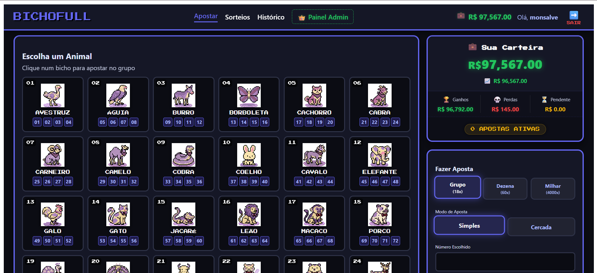
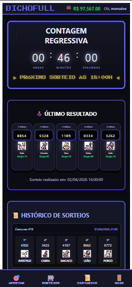

# 🕹️ BichoFull - Simulador Arcade de Jogo do Bicho

  

O **BichoFull** é uma plataforma que simula a mecânica do tradicional Jogo do Bicho brasileiro utilizando um sistema de **fichas virtuais**. O projeto foi desenvolvido seguindo padrões de engenharia de software, com uma interface temática inspirada em máquinas de fliperama (Arcade/Retro).

  

---

  

## 📸 Demonstração do Sistema

  

| Home |  
  

| Apostas |
 

| Sorteios |
 
  

---

  

## 🛠️ Tecnologias e Arquitetura Utilizadas

  

O sistema foi construído sobre uma **Arquitetura em Camadas (Layered Architecture)**, separando responsabilidades para facilitar a manutenção e os testes.

  

### **Backend (Spring Boot 3)**

*  **Java 17:** Linguagem base utilizada para garantir compatibilidade com as bibliotecas do ecossistema Spring Boot 3.

*  **Camada de Controller:** Gerencia os endpoints REST e a comunicação com o Frontend.

*  **Camada de Service:** Centraliza as regras de negócio, como o cálculo de grupos de animais e processamento de prêmios.

*  **Camada de Repository:** Abstração do banco de dados via Spring Data JPA.

*  **Segurança:** Autenticação Stateless com **JWT (JSON Web Token)** e criptografia de senhas com **BCrypt**.

*  **Banco de Dados:** MySQL com controle de versão via **Flyway Migrations** (V1 a V5).

  
### **Frontend (Angular 18)**

*  **Signals:** Gerenciamento de estado reativo para atualização em tempo real do saldo e mensagens.

*  **Standalone Components:** Estrutura modular moderna sem a necessidade de NgModules.

*  **Interceptors:** Anexação automática do token JWT em todas as requisições autenticadas.


---

  

## 📝 Regras de Negócio e Apostas

  

### **Categorias e Multiplicadores**

| **Grupo** | Acerte o grupo do animal (1-25) | **18x** |

| **Dezena** | Acerte os 2 últimos dígitos do prêmio | **60x** |

| **Milhar** | Acerte os 4 dígitos exatos do prêmio | **4000x** |

  

### **Modos de Jogo**

*  **Simples (Cabeça):** Aposta válida apenas para o 1º prêmio sorteado.

*  **Cercada (1º ao 5º):** O valor apostado é dividido por 5. Se o bicho/número sair em qualquer uma das 5 posições, o usuário ganha proporcionalmente.

  

---


# ⚡ Principais Funcionalidades

| Categoria        | Funcionalidade       | Descrição                                   |              
| ---------------- | -------------------- | ------------------------------------------- | 
| 👤 **Usuário** | Cadastro             | Criação de conta com nome, e-mail e senha   |               
| 👤 **Usuário** | Login                | Autenticação segura via JWT                 |
| 👤 **Usuário** | Saldo inicial        | R$ 1.000,00 em fichas para começar          |
| 👤 **Usuário** | Carteira virtual     | Saldo atualizado em tempo real              |
|                  |                      |                                             |
| 🎲 **Apostas** | Tabela de animais    | Interface com os 25 grupos do jogo do bicho |
| 🎲 **Apostas** | Aposta por Grupo     | Escolha um animal (1 a 25)                  |
| 🎲 **Apostas** | Aposta por Dezena    | Escolha dois números (00 a 99)              |
| 🎲 **Apostas** | Aposta por Milhar    | Escolha quatro números (0000 a 9999)        |
| 🎲 **Apostas** | Aposta Cercada    | Pode ser sorteado em qialquer um dos 5 prêmios      |
| 🎲 **Apostas** | Validação de saldo   | Impede apostas com saldo insuficiente       |
|                  |                      |                                             |
| 🏆 **Sorteios** | Sorteio automático   | Geração aleatória de 5 milhares             |
| 🏆 **Sorteios** | Sorteio manual       | Admin pode simular sorteios                 |
| 🏆 **Sorteios** | Cálculo de prêmios   | Grupo: 18x / Dezena: 60px / Milhar: 4000x | Cercada: Divisão do valor por 5
|                  |                      |                                             |
| 📊 **Histórico** | Histórico de apostas | Visualização das apostas realizadas         |
| 📊 **Histórico** | Resultados           | Ganhos e perdas por aposta                  |

---
  

## 🚀 Instalação e Execução (Passo a Passo)

  

### **1. Pré-requisitos**

* [Docker Desktop](https://www.docker.com/products/docker-desktop/) instalado e rodando.

* [Node.js v18 ou superior](https://nodejs.org/).

* [Java JDK 17](https://www.oracle.com/java/technologies/javase/jdk17-archive-downloads.html).

  

### **2. Execução**

  
  Na raiz do projeto, execute o comando para subir os containers do MySQL e da aplicação:

  ```bash

  docker-compose  up  -d
  ```
  *O sistema criará o banco `db_bichofull` e `spring_bichofull` automaticamente.*


  Navegue até a pasta `frontend`. 

  ```bash
  cd frontend 
  ```
  O comando `install` baixará o Angular CLI, Tailwind CSS e bibliotecas RxJS:
  ```bash
  npm install
  ```
  E por fim, para executar o sistema:
  ```bash
  npm start
  ```

### **3. Acesso ao sistema**
**Frontend:** `http://localhost:4200`

**Backend API:** `http://localhost:8080`

### **4. Suíte de Testes**

O projeto inclui testes automatizados para garantir a estabilidade e segurança:

**Testes de Integração:**

-   **ConcurrencyIT:** Valida o bloqueio otimista para impedir que cliques simultâneos dupliquem o saldo.
- **AuthControllerIT:** simula o comportamento de um usuário tentando se registrar e logar no sistema, verifica se os endpoints `/api/auth/register` e `/api/auth/login` estão expostos corretamente e aceitam o verbo `POST`. Valida se o Spring consegue transformar corretamente os DTOs (`UserRegistrationDTO`, `LoginDTO`) em JSON e vice-versa e confirma que, ao registrar um usuário, os dados passam pelo `Service`, a senha é criptografada pelo `PasswordEncoder` e o registro é salvo com sucesso no MySQL.
-  **DatabaseConstraintTest:** Valida se o banco impede saldos negativos via CHECK constraints.
-  **DrawIT:**: Executa um ciclo completo de sorteio. Insere um Admin e um Jogador reais, realiza o sorteio e verifica se, após a transação, o saldo no banco de dados MySQL foi atualizado corretamente. O uso de `@Transactional` garante que o banco volte ao estado original após o teste.
    
-   **SecurityAuthorizationIT:** Garante que apenas perfis ADMIN acessem funções críticas de sorteio. Utiliza o Spring Security e o Filtro de Autenticação para barrar requisições não autorizadas.

**Testes Unitários:**

-   **DrawServiceTest:** Valida os multiplicadores corretos (18x, 60x, 4000x) e a divisão de valor para apostas no modo cercado.
  
   -   **TokenServiceTest:** Testa a segurança. Garante que o sistema consegue gerar um Token JWT válido e que ele retorna `null`, bloqueando o acesso se o token for inválido ou adulterado.
  -   **UserTest:** Garante que a entidade de usuário nunca fique com saldo negativo. Testa se o método `debitBalance` lança uma exceção se o valor for maior que o saldo ou se for um número negativo/zero.
 -   **BetServiceTest:** Valida a "matemática do bicho". Testa se, ao apostar na milhar `1242`, o sistema identifica corretamente que o animal é o **Cavalo (Grupo 11)** e se o saldo do usuário é deduzido corretamente no momento da aposta.
 
Para executar os testes, dentro da pasta backend, digite:
```bash
./mvnw test
```

### **5. Lint no Frontend**

-   **SLint:** impede que o código tenha variáveis não utilizadas, obriga o uso de boas práticas do Angular 18 (como o uso de `Signals`) e mantém a consistência entre os componentes.
    
-   **Prettier:** Focado na estética. Formata automaticamente as quebras de linha, o uso de aspas e a indentação toda vez que um arquivo é salvo no projeto, evitando conflitos de estilo no Git entre diferentes desenvolvedores.

### **5. Documentação do Código - JSDoc**

O frontend deste projeto utiliza o padrão JSDoc para documentar classes, métodos e propriedades nos arquivos TypeScript. Esta prática foi adotada para garantir que o sistema siga padrões profissionais de engenharia de software, oferecendo:

-   **Manual Integrado:** Ao passar o mouse sobre qualquer função ou componente, o editor exibe uma descrição detalhada, parâmetros esperados e tipos de retorno, funcionando como um manual de instruções.

-   **Tags Inteligentes:** Utiliza-se tags como @class, @method, @param e @description para estruturar a explicação de lógicas complexas, como o motor da roleta e os interceptores de segurança.


### ⚠️ **Este projeto é destinado exclusivamente para fins acadêmicos.**